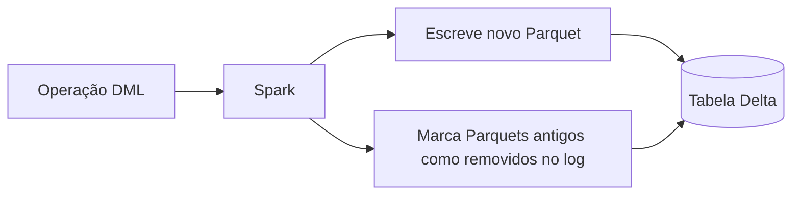

# Delta Lake

## O que é

**Delta Lake** é uma camada de armazenamento de código aberto criada pela **Databricks**
em 2019. Ele estende arquivos Parquet com um **transaction log**, transformando uma
pasta de Parquet em uma tabela com garantias de banco de dados:

- Transações **ACID**,
- Operações `UPDATE`, `DELETE` e `MERGE`,
- **Time Travel** (consulta a versões anteriores),
- *Schema evolution* e *schema enforcement*,
- Escritas e leituras concorrentes seguras.

---

## Arquitetura

Cada tabela Delta é uma pasta com duas partes:

```
/tmp/vendas/
├── part-00000-xxx.snappy.parquet    ← os dados (Parquet imutável)
├── part-00001-xxx.snappy.parquet
└── _delta_log/                       ← o transaction log
    ├── 00000000000000000000.json     ← versão 0 (criação)
    ├── 00000000000000000001.json     ← versão 1 (INSERT)
    ├── 00000000000000000002.json     ← versão 2 (UPDATE)
    └── 00000000000000000003.json     ← versão 3 (DELETE)
```

Cada arquivo JSON em `_delta_log/` registra **quais arquivos Parquet foram adicionados
e removidos** naquela operação. Como Parquet é imutável, qualquer mudança gera arquivos
novos — o log é a fonte da verdade sobre o estado atual.



Esse padrão é chamado de **copy-on-write**.

---

## Operações DML implementadas

A tabela `vendas` é a base. Os exemplos abaixo são exatamente os usados em
`notebooks/delta-lake.ipynb`.

### Criação e carga inicial

```python
data = [
    (1, "Notebook", 3000),
    (2, "Mouse", 100),
    (3, "Teclado", 200),
]

df = spark.createDataFrame(data, ["id", "produto", "preco"])
df.write.format("delta").mode("overwrite").save("/tmp/vendas")
```

`mode("overwrite")` garante que, se a tabela já existir, ela é substituída — útil para
poder rodar o notebook várias vezes sem erro.

Resultado:

```
+---+--------+-----+
| id| produto|preco|
+---+--------+-----+
|  1|Notebook| 3000|
|  2|   Mouse|  100|
|  3| Teclado|  200|
+---+--------+-----+
```

---

### INSERT

Para adicionar novos registros sem perder os existentes, use `mode("append")`:

```python
novo = spark.createDataFrame(
    [(4, "Monitor", 1200)],
    ["id", "produto", "preco"]
)
novo.write.format("delta").mode("append").save("/tmp/vendas")
```

Resultado:

```
+---+--------+-----+
| id| produto|preco|
+---+--------+-----+
|  1|Notebook| 3000|
|  4| Monitor| 1200|
|  3| Teclado|  200|
|  2|   Mouse|  100|
+---+--------+-----+
```

---

### UPDATE

A API `DeltaTable` expõe operações DML programáticas:

```python
from delta.tables import DeltaTable

deltaTable = DeltaTable.forPath(spark, "/tmp/vendas")

deltaTable.update(
    condition="id = 2",
    set={"preco": "150"}
)
```

Resultado:

```
+---+--------+-----+
| id| produto|preco|
+---+--------+-----+
|  1|Notebook| 3000|
|  4| Monitor| 1200|
|  3| Teclado|  200|
|  2|   Mouse|  150|
+---+--------+-----+
```

> Por baixo: o Spark lê os Parquets antigos, escreve um Parquet novo com a linha alterada
> e registra no `_delta_log` que o antigo foi removido.

---

### DELETE

```python
deltaTable.delete("id = 3")
```

Resultado:

```
+---+--------+-----+
| id| produto|preco|
+---+--------+-----+
|  1|Notebook| 3000|
|  4| Monitor| 1200|
|  2|   Mouse|  150|
+---+--------+-----+
```

---

## Time Travel (versionamento)

Como o `_delta_log` mantém todas as versões, é possível ler a tabela como ela estava em
qualquer ponto do passado:

```python
# por número de versão
df_v0 = spark.read.format("delta").option("versionAsOf", 0).load("/tmp/vendas")

# por data/hora
df_ontem = (
    spark.read.format("delta")
        .option("timestampAsOf", "2026-05-06 12:00:00")
        .load("/tmp/vendas")
)
```

Casos de uso típicos: auditoria, rollback de erros, reprodução de relatórios antigos
e debug de pipelines.

---

## Comandos úteis

```python
# histórico completo da tabela
deltaTable.history().show()

# detalhes da tabela (schema, propriedades, localização)
spark.sql("DESCRIBE DETAIL delta.`/tmp/vendas`").show()

# limpar arquivos antigos (retention default = 7 dias)
deltaTable.vacuum()
```

---

## Vantagens e quando usar

| Vantagem                  | Aplicação típica                               |
|---------------------------|------------------------------------------------|
| ACID                      | Cargas críticas onde inconsistência custa caro |
| UPDATE / DELETE / MERGE   | CDC, GDPR (direito ao esquecimento), upserts   |
| Time Travel               | Auditoria, debug, snapshots                    |
| Schema enforcement        | Evita corromper a tabela com tipos errados     |

Delta Lake é especialmente forte em ambientes **Databricks**, mas funciona em qualquer
Spark, Trino, Flink ou via *Delta Standalone*.
