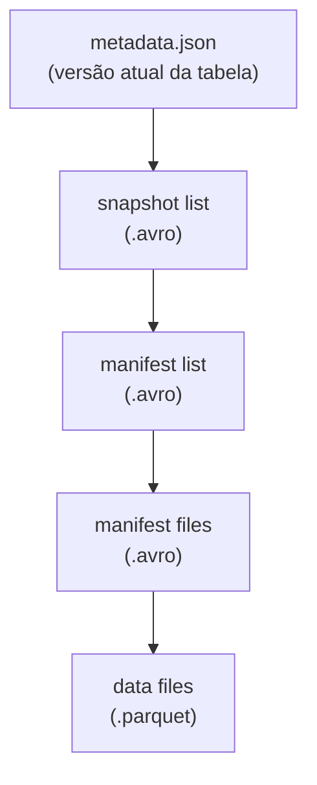

# Apache Iceberg

## O que é

**Apache Iceberg** é um formato de tabela analítico moderno, criado pela **Netflix** em
2018 e doado para a Apache Software Foundation. Foi projetado desde o início para ser
**engine-agnóstico** — a mesma tabela pode ser lida e escrita por Spark, Trino, Flink,
Presto, Snowflake, Dremio e outras ferramentas, sem lock-in em uma engine.

Como o Delta Lake, ele estende arquivos Parquet com metadados que adicionam:

- Transações **ACID**,
- `INSERT`, `UPDATE`, `DELETE`, `MERGE`,
- **Snapshots** versionados (time travel),
- *Schema evolution* e *partition evolution*,
- *Hidden partitioning*.

---

## Arquitetura

A maior diferença em relação ao Delta é a estrutura de metadados em **três camadas**:



Cada operação gera um novo `metadata.json`, que aponta para um novo *snapshot*. Esse
desenho permite operações eficientes mesmo em tabelas com milhões de arquivos.

```
/tmp/iceberg-warehouse/db_vendas/vendas/
├── data/
│   ├── 00000-x-xxx.parquet           ← dados
│   └── ...
└── metadata/
    ├── v1.metadata.json               ← versão 1
    ├── v2.metadata.json               ← versão 2
    ├── snap-xxx.avro                  ← snapshot list
    └── xxx.avro                       ← manifest files
```

---

## Operações DML implementadas

Diferente do Delta (que usa API Python no projeto), Iceberg neste trabalho é manipulado
**inteiramente via SQL** — a sintaxe é idêntica à de um banco relacional.

### Criação do banco e da tabela

```sql
CREATE DATABASE db_vendas;

CREATE TABLE spark_catalog.db_vendas.vendas (
    id      INT,
    produto STRING,
    preco   INT
) USING iceberg;
```

`spark_catalog` é o catálogo padrão configurado na `SparkSession` para usar Iceberg.

---

### INSERT

```sql
INSERT INTO spark_catalog.db_vendas.vendas VALUES
    (1, 'Notebook', 3000),
    (2, 'Mouse', 100),
    (3, 'Teclado', 200);
```

```sql
SELECT * FROM spark_catalog.db_vendas.vendas;
```

```
+---+--------+-----+
| id| produto|preco|
+---+--------+-----+
|  1|Notebook| 3000|
|  2|   Mouse|  100|
|  3| Teclado|  200|
+---+--------+-----+
```

---

### UPDATE

```sql
UPDATE spark_catalog.db_vendas.vendas
SET preco = 150
WHERE id = 2;
```

```
+---+--------+-----+
| id| produto|preco|
+---+--------+-----+
|  2|   Mouse|  150|
|  1|Notebook| 3000|
|  3| Teclado|  200|
+---+--------+-----+
```

> Por baixo: Iceberg cria um novo Parquet com a linha alterada, gera um novo snapshot
> apontando para ele e marca o Parquet antigo como substituído.

---

### DELETE

```sql
DELETE FROM spark_catalog.db_vendas.vendas
WHERE id = 3;
```

```
+---+--------+-----+
| id| produto|preco|
+---+--------+-----+
|  2|   Mouse|  150|
|  1|Notebook| 3000|
+---+--------+-----+
```

---

## Time Travel

Cada operação cria um novo *snapshot*. É possível consultar a tabela em qualquer
snapshot anterior:

```sql
-- por id de snapshot
SELECT * FROM spark_catalog.db_vendas.vendas
VERSION AS OF 1234567890123456789;

-- por data/hora
SELECT * FROM spark_catalog.db_vendas.vendas
TIMESTAMP AS OF '2026-05-06 12:00:00';
```

Para listar o histórico de snapshots:

```sql
SELECT * FROM spark_catalog.db_vendas.vendas.snapshots;
SELECT * FROM spark_catalog.db_vendas.vendas.history;
```

---

## Hidden Partitioning

Um diferencial do Iceberg em relação ao Delta: o particionamento é **escondido**. Você
declara apenas a regra; o Iceberg cuida das colunas físicas.

```sql
CREATE TABLE vendas_particionada (
    id      INT,
    produto STRING,
    preco   INT,
    data    TIMESTAMP
) USING iceberg
PARTITIONED BY (days(data));
```

Consultas com `WHERE data = '...'` automaticamente filtram apenas as partições
relevantes — sem o usuário precisar conhecer o esquema de partição.

---

## Vantagens e quando usar

| Vantagem                       | Aplicação típica                                 |
|--------------------------------|--------------------------------------------------|
| Engine-agnóstico               | Stack heterogêneo (Spark + Trino + Flink)        |
| Hidden partitioning            | Tabelas grandes com particionamento que evolui   |
| Snapshot eficiente             | Time travel em tabelas com milhões de arquivos   |
| Schema/partition evolution     | Modelagem que muda ao longo do tempo             |

Iceberg costuma ser a escolha quando há **múltiplas engines** acessando os mesmos dados,
ou quando o particionamento muda com o tempo sem que se queira reescrever a tabela.

---

## Delta vs Iceberg — resumo

| Aspecto              | Delta Lake                            | Apache Iceberg                          |
|----------------------|---------------------------------------|-----------------------------------------|
| Origem               | Databricks (2019)                     | Netflix (2018), hoje Apache             |
| Metadados            | Transaction log (`_delta_log/*.json`) | 3 camadas (metadata → manifest → data)  |
| Sintaxe no projeto   | API Python (`DeltaTable.update`)      | SQL (`UPDATE ... SET ... WHERE`)        |
| Particionamento      | Estático                              | Hidden (evolui)                         |
| Engine principal     | Spark / Databricks                    | Multi-engine desde o desenho            |
