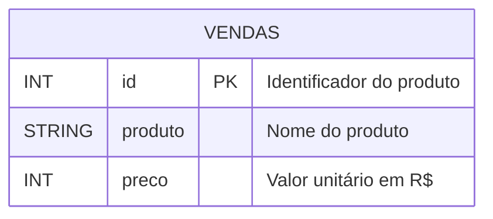
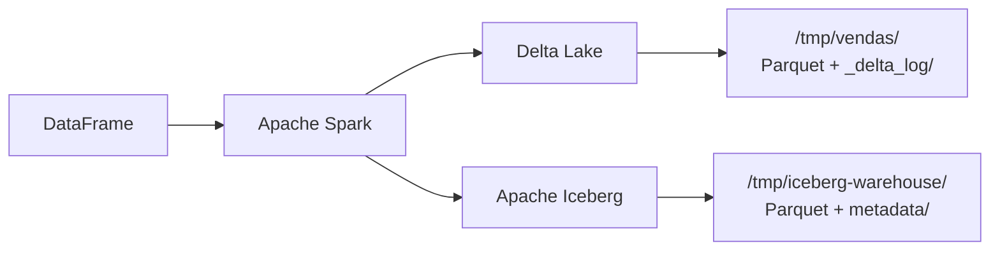

# Contextualização do Trabalho

## Objetivo

Demonstrar, na prática, o uso do **Apache Spark** em conjunto com as tecnologias de tabela
**Delta Lake** e **Apache Iceberg** em um cenário de engenharia de dados, evidenciando
operações DML (`INSERT`, `UPDATE`, `DELETE`) e os benefícios de cada formato (transações ACID,
versionamento, time travel).

Este trabalho é parte da disciplina de **Arquitetura de Dados**.

---

## Cenário

O cenário simula o sistema de uma **loja de eletrônicos**, que precisa registrar e manter
um catálogo de produtos vendidos. A tabela `vendas` armazena, para cada produto:

- um identificador único,
- o nome do produto,
- e o preço.

Esse cenário é simples de propósito — o foco do trabalho está em **como** os dados são
armazenados, modificados e versionados, não na complexidade do modelo.

---

## Modelo ER

Como o cenário envolve uma única entidade, o modelo é direto:



| Campo     | Tipo     | Descrição                          | Restrição        |
|-----------|----------|------------------------------------|------------------|
| `id`      | `INT`    | Identificador único do produto     | Chave primária   |
| `produto` | `STRING` | Nome do produto                    | Não nulo         |
| `preco`   | `INT`    | Preço unitário em reais            | Não nulo         |

---

## Códigos DDL

A mesma tabela é criada nos dois formatos para permitir comparação direta.

### Delta Lake

No Delta, a tabela é criada implicitamente pela primeira escrita de um DataFrame com o
formato `delta`. Não há `CREATE TABLE` SQL — o schema é inferido do DataFrame e o
*transaction log* é gerado automaticamente em `_delta_log/`.

```python
from pyspark.sql import SparkSession

data = [
    (1, "Notebook", 3000),
    (2, "Mouse", 100),
    (3, "Teclado", 200),
]

df = spark.createDataFrame(data, ["id", "produto", "preco"])

df.write.format("delta").mode("overwrite").save("/tmp/vendas")
```

Equivalente em SQL (se quisesse criar antes de inserir):

```sql
CREATE TABLE vendas (
    id      INT,
    produto STRING,
    preco   INT
) USING delta
LOCATION '/tmp/vendas';
```

### Apache Iceberg

No Iceberg, a tabela é criada explicitamente via SQL DDL, dentro de um catálogo:

```sql
CREATE DATABASE db_vendas;

CREATE TABLE spark_catalog.db_vendas.vendas (
    id      INT,
    produto STRING,
    preco   INT
) USING iceberg;
```

---

## Fonte dos dados

Para fins de demonstração, os dados são **sintéticos**, definidos diretamente no código
dos notebooks como uma lista de tuplas Python e convertidos em DataFrame pelo Spark.

| id | produto   | preco |
|----|-----------|-------|
| 1  | Notebook  | 3000  |
| 2  | Mouse     | 100   |
| 3  | Teclado   | 200   |

A escolha por uma fonte sintética se justifica porque o trabalho avalia o comportamento
das tecnologias de armazenamento (Delta/Iceberg) sob operações DML — o conteúdo dos dados
em si é irrelevante para essa avaliação.

---

## Onde os dados são armazenados

Ambos os formatos usam **arquivos Parquet** como camada física, mas adicionam camadas de
metadados próprias para garantir transações ACID e versionamento.



| Formato       | Caminho local                                | Estrutura                            |
|---------------|----------------------------------------------|--------------------------------------|
| Delta Lake    | `/tmp/vendas`                                | `*.parquet` + `_delta_log/*.json`    |
| Iceberg       | `/tmp/iceberg-warehouse/db_vendas/vendas`    | `data/*.parquet` + `metadata/*`      |

---

## Estrutura do projeto

```
spark-delta/
├── notebooks/
│   ├── delta-lake.ipynb     # operações DML em Delta Lake
│   └── iceberg.ipynb        # operações DML em Apache Iceberg
├── site/                    # documentação MkDocs (esta página)
│   ├── docs/
│   └── mkdocs.yml
├── README.md                # instruções de reprodução do ambiente
└── .gitignore
```

---

## Próximas páginas

- [Apache Spark](spark.md) — o motor de processamento que sustenta tudo
- [Delta Lake](delta.md) — operações DML e arquitetura
- [Apache Iceberg](iceberg.md) — operações DML e arquitetura
