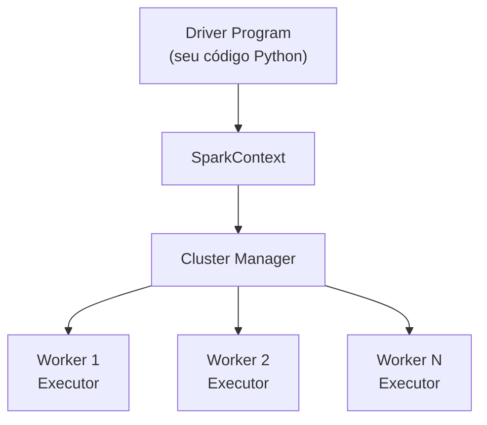

# Apache Spark (PySpark)

## O que é

O **Apache Spark** é um motor de processamento de dados **distribuído** e **em memória**,
projetado para trabalhar com grandes volumes de dados de forma paralela. Surgiu em 2009
em Berkeley e hoje é um dos projetos mais usados em engenharia de dados e analytics.

Ele expõe APIs em **Scala**, **Java**, **Python** e **R**. Quando usado a partir do Python,
recebe o nome de **PySpark**.

---

## Por que usar Spark

| Característica          | O que significa na prática                                     |
|-------------------------|----------------------------------------------------------------|
| Distribuído             | Divide o trabalho entre vários núcleos ou várias máquinas      |
| Em memória              | Mantém dados na RAM entre etapas, evitando ler do disco        |
| Lazy evaluation         | Só executa quando uma ação (`show`, `save`) é chamada          |
| Múltiplos formatos      | Lê e escreve Parquet, CSV, JSON, Avro, Delta, Iceberg, JDBC... |
| SQL nativo              | Permite consultar DataFrames com SQL puro                       |

---

## Arquitetura básica



- **Driver**: o processo que roda seu código e coordena.
- **Cluster Manager**: distribui tarefas (pode ser standalone, YARN, Kubernetes ou local).
- **Executors**: processos que executam as tarefas em paralelo.

Neste projeto, o Spark roda em **modo local** (single node) dentro do WSL — o cluster
manager é o próprio processo local, mas a **mesma sintaxe** funcionaria em um cluster
com 100 máquinas.

---

## Conceitos fundamentais

### DataFrame
Estrutura de dados tabular, similar a uma tabela SQL ou um `pandas.DataFrame`, porém
**distribuída** entre os executores e **imutável**.

```python
df = spark.createDataFrame(
    [(1, "Notebook", 3000), (2, "Mouse", 100)],
    ["id", "produto", "preco"]
)
df.show()
```

### Lazy Evaluation
Operações como `select`, `filter`, `withColumn` apenas constroem um **plano de execução**.
Nada é processado até uma **ação** (`show`, `count`, `write.save`, `collect`) ser chamada.

### Transformações vs Ações

| Tipo            | Exemplos                                | Quando executa             |
|-----------------|-----------------------------------------|----------------------------|
| Transformação   | `select`, `filter`, `groupBy`, `join`   | Não executa, só planeja    |
| Ação            | `show`, `count`, `collect`, `write`     | **Executa o plano todo**   |

---

## SparkSession — o ponto de entrada

Toda aplicação PySpark começa criando uma `SparkSession`. Neste projeto, a sessão é
configurada de formas ligeiramente diferentes para Delta e Iceberg, porque cada um
exige extensões específicas.

### Configuração para Delta Lake

```python
from delta import configure_spark_with_delta_pip
from pyspark.sql import SparkSession

builder = (
    SparkSession.builder
        .appName("DeltaExample")
        .config("spark.sql.extensions", "io.delta.sql.DeltaSparkSessionExtension")
        .config("spark.sql.catalog.spark_catalog", "org.apache.spark.sql.delta.catalog.DeltaCatalog")
)

spark = configure_spark_with_delta_pip(builder).getOrCreate()
```

### Configuração para Apache Iceberg

```python
from pyspark.sql import SparkSession

spark = (
    SparkSession.builder
        .appName("IcebergExample")
        .config("spark.jars.packages", "org.apache.iceberg:iceberg-spark-runtime-3.5_2.12:1.4.2")
        .config("spark.sql.catalog.spark_catalog", "org.apache.iceberg.spark.SparkSessionCatalog")
        .config("spark.sql.catalog.spark_catalog.type", "hadoop")
        .config("spark.sql.catalog.spark_catalog.warehouse", "/tmp/iceberg-warehouse")
        .getOrCreate()
)
```

---

## Versões usadas neste projeto

| Componente   | Versão  |
|--------------|---------|
| Python       | 3.10    |
| PySpark      | 3.5.1   |
| Delta Spark  | 3.1.0   |
| Iceberg      | 1.4.2 (`iceberg-spark-runtime-3.5_2.12`) |
| Java JDK     | 17      |

---

## Por que Spark sozinho não basta

O Spark lê e escreve Parquet nativamente, **mas Parquet puro não tem**:

- transações ACID,
- `UPDATE`/`DELETE` linha a linha,
- versionamento (time travel),
- garantia de consistência em escritas concorrentes.

É exatamente para suprir essas lacunas que existem **Delta Lake** e **Apache Iceberg**.
